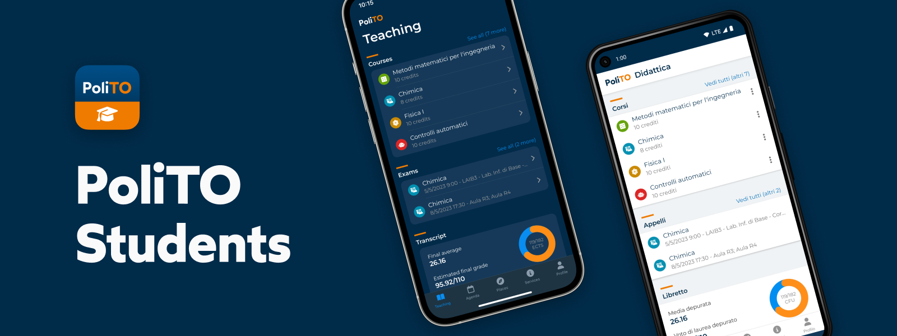

# PoliTO Students App

Politecnico di Torino's official mobile application for students.

## Install

### From app stores

[Google Play Store](https://play.google.com/store/apps/details?id=it.polito.students)  
[Apple App Store](https://testflight.apple.com/join/7e7wafnF)

### Start from source

To start the app locally you'll need git and a recent version of Node.js (see [Contributing](./CONTRIBUTING.md#project-setup)) for more details.

## Join the discussion

We use GitHub [Discussions](https://github.com/polito/students-app/discussions) as a place to gather feedback, provide support, share ideas and connect with the community.

You are more than welcome to add your input on any topic, but please keep in mind that this is a public space and we expect everyone to be respectful and constructive.

## Talk with us

Feel free to [open an issue](https://github.com/polito/students-app/issues/new/choose) if:

- you want to propose a new feature
- something is not working properly

One of the maintainers will triage your issue and define a course of action for it.

## Roadmap and feature proposals

We use GitHub [Projects](https://github.com/orgs/polito/projects/2) to keep track of the roadmap.  
If you would like to propose a new feature, feel free to open an [issue](https://github.com/polito/students-app/issues/new) with the Feature Proposal template.

## Contributing

Always refer to [Contributing](./CONTRIBUTING.md) to get started working on this project.

### If you open an issue and are willing to implement it

If you open an issue and are willing to implement it, please specify it in the issue description.

Please wait for feedback from the maintainers before implementing your fix. The maintainer will assign the issue to you after triage.

### If you want to take care of an open issue

If you want to take care of an open issue please reply into the issue thread and wait for assignment confirmation from the maintainers.

## License

This project is licensed under the EUPL - European Union Public License, version 1.2. Read the [full license](./LICENSE.md) for details.
